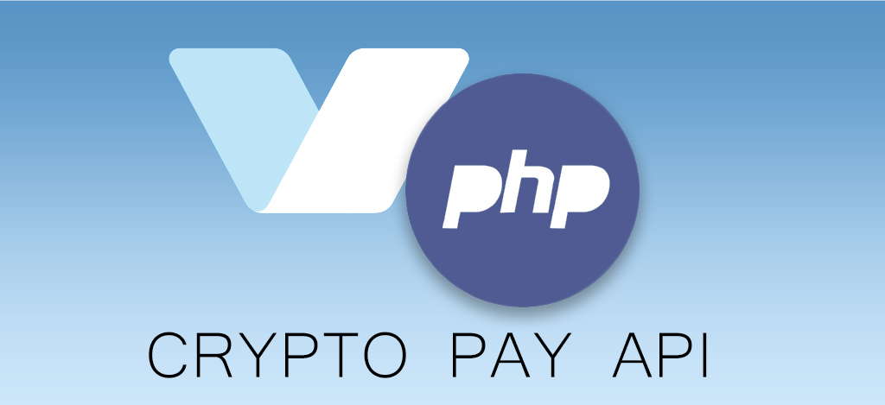

# klev-o/crypto-pay-api

Simple and convenient implementation Crypto Pay API with php version ^7.4 support. Based on the [Official Crypto Pay Api](https://help.crypt.bot/crypto-pay-api)

[](https://github.com/klev-o/crypto-pay-api/blob/main/LICENSE)


## 📖 Intro

Fully object-oriented and simple code. All available types and methods are described using classes with documentation of all fields.  For each class, the url to the documentation is indicated, where you can study the nuances, etc.

## 🛠 Installation

Run this command in your command line:
```php
composer require klev-o/crypto-pay-api
```

## 🔌Usage

### Common

First, you need to create an object of the CryptoPay class, passing the API key of your application to the constructor:


```php
<?php

require_once '../vendor/autoload.php';

$api = new \Klev\CryptoPayApi\CryptoPay('YOUR_APP_TOKEN');
```

> To create an app and get an api token, open [@CryptoBot](http://t.me/CryptoBot?start=pay) or [@CryptoTestnetBot](http://t.me/CryptoTestnetBot?start=pay) (for testnet), send /pay command, then go to ‘Create App’.

You can pass the second parameter $isTestnet to the CryproPay constructor to make all requests go through the testnet. This is useful for any experiments)

```php
<?php

require_once '../vendor/autoload.php';

//the second parameter true - activates the testnet
$api = new \Klev\CryptoPayApi\CryptoPay('YOUR_APP_TOKEN', true);
```
Then you can call all possible methods. To check that everything is working correctly, you can call the `$api->getMe()` method, which will return basic information about your application.

```php
<?php

require_once '../vendor/autoload.php';

$api = new \Klev\CryptoPayApi\CryptoPay('YOUR_APP_TOKEN');

$result = $api->getMe();

print_r($result)
```

If everything works well, then you will see something like this

```php
//Display if everything is working well
Array
(
    [app_id] => 12345 //your id will be different
    [name] => Some App //your name will be different
    [payment_processing_bot_username] => CryptoBot
)
```


For more complex methods, value objects are used, for example, this is how you can create invoices:

```php
<?php

use Klev\CryptoPayApi\Methods\CreateInvoice;
use Klev\CryptoPayApi\CryptoPay;
use Klev\CryptoPayApi\Enums\PaidBtnName;

require_once '../vendor/autoload.php';

$api = new CryptoPay('YOUR_APP_TOKEN');

$data = new CreateInvoice('TON', '0.53');
$data->allow_anonymous = false;
$data->paid_btn_name = PaidBtnName::OPEN_CHANNEL;

$createdInvoice = $api->createInvoice($data)
```

As you can see above, required parameters are passed through the constructor, while optional parameters can be set directly. Also, for values that expect "one of", special enums are created, located at the namespace `Klev\CryptoPayApi\Enums`.

By the same principle, objects are created for the methods `getInvoice()` and `Transfer()`

***

More detailed examples can be found in the [demo directory](https://github.com/klev-o/crypto-pay-api/tree/main/demo)

All available methods can be viewed at the `$api` object, or refer to the [official documentation](https://telegra.ph/Crypto-Pay-API-11-25)

### Webhooks

Using a webhook, you can receive updates for your application

> Please note that the interceptor must first be activated in your application. This can be done in the following way: open [@CryptoBot](http://t.me/CryptoBot?start=pay) or [@CryptoTestnetBot](http://t.me/CryptoTestnetBot?start=pay) (for testnet), send /pay command, then go to ‘My Apps’, choose your app, open ‘Webhooks’ and click ‘Enable Webhooks’. Read more [here](https://telegra.ph/Crypto-Pay-API-11-25#Webhooks)

To receive updates, you need to use the `$api->getWebhookUpdates()` method and subscribe to listen for the necessary events. There is currently only one event (or update type) available - invoice_paid. It also has an enum - `PaidType::INVOICE_PAID`:

```php
<?php

use Klev\CryptoPayApi\Methods\CreateInvoice;
use Klev\CryptoPayApi\CryptoPay;
use Klev\CryptoPayApi\Enums\PaidType;
use Monolog\Handler\StreamHandler;
use Monolog\Logger;

require_once '../vendor/autoload.php';

//The logger does not have to be created, it is used only for an example
$log = new Logger('App');
$log->pushHandler(new StreamHandler('../var/logs/app.log'));

$api = new CryptoPay('YOUR_APP_TOKEN');
$api->setEnableEvents(true);

//subscribe to an event
$api->on(PaidType::INVOICE_PAID, static function(Update $update) use ($log) {
    //do something with the data
    $log->info('webhook data: ', (array)$update);
});

$api->getWebhookUpdates();
```

You can register multiple handlers for the same event.

> You can also just get the result from the `$api->getWebhookUpdates()` method without subscribing to events

> By default, events are disabled. To enable them, you need to use the method `$api->setEnableEvents(true);`

## 📟Advanced

Also, as an event handler, you can use anything that corresponds to the callable type. Let's take an example:

> Let's say we have installed `composer require php-di/php-di`, although you can use any other psr-compatible

```php
<?php

use Klev\CryptoPayApi\CryptoPay;
use Klev\CryptoPayApi\Enums\PaidType;
use Monolog\Handler\StreamHandler;
use Monolog\Logger;
use Psr\Log\LoggerInterface;

require_once '../vendor/autoload.php';

$api = new CryptoPay('YOUR_APP_TOKEN');

//Use Container builder
$builder = new DI\ContainerBuilder();

$builder->addDefinitions([
    //specify the rules on how to create an object
    LoggerInterface::class => function(\DI\Container $c) {
        $log = new Logger('App');
        $log->pushHandler(new StreamHandler('../var/logs/app.log'));
        return $log;
    },
    //specify the rules on how to create an object
    InvoicePaidListener::class => function(\DI\Container $c) {
        return new InvoicePaidListener($c->get(LoggerInterface::class));
    }
]);
$container = $builder->build();

//Instead of using an anonymous function, we can now use a custom class, into which,
//if necessary, we can pull everything we need (working with the database, sending by mail, etc.)
class InvoicePaidListener
{
    private Logger $log;
    
    public function __construct(Logger $log)
    {
        $this->log = $log;
    }
    public function __invoke(Update $update)
    {
        $this->log->info('payload', (array)$update);
    }

}

//Now the event subscription looks more concise
$api->on(PaidType::INVOICE_PAID, $container->get(InvoicePaidListener::class));

$api->getWebhookUpdates();
```

You can use your dependency injection container to pipe all the necessary functionality from your code into handlers

## 🎁Dontations

Support the project if you like it. Funds will go towards food.

| Network                     | Currency          | Wallet                                                                                                                             |
|-----------------------------|-------------------|------------------------------------------------------------------------------------------------------------------------------------|
| Bitcoin                     | `BTC`             | `1M1qhSE6sN34a4d7ZtCh6y17Vf3LtdoW62`<br/>or<br/>`14cvXywCMucKMhFYDCbmQ1ZHhayDgbD65R`                                               |
| The Open Network            | `TON`             | `EQAYZK8rWrS9Fhojdc486BpplDmTSLHum440f-L2--SA2Oid` <br/> or<br/> `ton://transfer/UQBVsumSIvsq4PfeFMhxSV9m_zPB31cHJX4X2lAVh9BUJXm3` |
| Binance Smart Chain – BEP20 | `BNB, BUSD, USDT` | `0x674B09Ab418bb41C075847bde004bb7F492c2121`                                                                                       |

## 🧨Troubleshooting

Please, if you find any errors or not exactly - report this [problem page](https://github.com/klev-o/crypto-pay-api/issues)

## And finally...
Happy botting 🤖